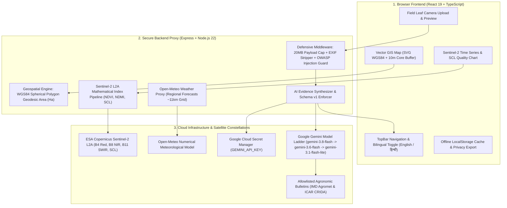

# FarmWatch — Evidence-Grounded Agricultural Inspection & Satellite AI Intelligence Platform

[](https://github.com/)
[](https://nodejs.org/)
[](https://react.dev/)
[](https://tailwindcss.com/)
[](https://ai.google.dev/)
[](https://cloud.google.com/run)
[](LICENSE)

FarmWatch is an evidence-grounded agricultural inspection and crop health monitoring platform engineered for smallholder farmers, cooperative managers, and agronomic extension officers across India (Maharashtra, Punjab, Karnataka) and emerging global agricultural regions.

Unlike consumer AI chat assistants or speculative agronomic apps, FarmWatch enforces **strict scientific grounding**: it reconciles dated Copernicus Sentinel-2 satellite observations, regional Open-Meteo numerical weather forecasts, confirmed laboratory soil health cards, and smartphone crop leaf photography. Every piece of advice is bound to peer-reviewed agronomic bulletins (ICAR / IMD Agromet) through **Schema v1 structured output**, avoiding ungrounded synthetic chemical dosage prescriptions or false claims of real-time satellite feeds.

---

## 📸 User Interface & Architecture Preview

### ASCII Dashboard & Command Layout
```text
+----------------------------------------------------------------------------------------------------+
|  [🌱 FarmWatch]    Inspection Overview | Fields & GIS | Satellite | Evidence & AI | Soil & Weather   [EN|हिन्दी] [+ Add Field] |
+----------------------------------------------------------------------------------------------------+
|  TENANT: Nashik Farmer Cooperative · 3 Monitored Parcels · Sentinel-2 Harmonized L2A               |
|                                                                                                    |
|  🌾 Plot 4A - Durum Wheat & Inter-Canopy (0.85 ha · HI 8627 Wheat)                                |
|  ------------------------------------------------------------------------------------------------  |
|  ⚠️ VEGETATIVE ANOMALY ALERT: Rule s2-anomaly-rule-v1                                              |
|     Absolute NDVI fall: -0.266 (0.578 -> 0.312) · Relative decline: -46.0% (Threshold: >=20%)       |
|     [📷 Upload Leaf Photo]   [📋 Log Physical Field Inspection]   [📈 View Sentinel Timeline]       |
+----------------------------------------------------------------------------------------------------+
|  [🗺️ PARCEL GEOMETRY]          |  [🛰️ SENTINEL-2 INDICES]         |  [🌦️ AGRO-WEATHER OUTLOOK]     |
|  · Geodesic Area: 0.85 ha       |  · NDVI (Greenness): 0.312       |  · Current Temp: 28.4°C         |
|  · WGS84 EPSG:4326              |  · NDMI (Moisture): 0.059        |  · High: 31.5°C · Low: 19.8°C   |
|  · 10m Inward Core Buffer: Pass |  · Core Coverage: 94% (Valid 21) |  · Past 3-Day Rain: 2.4 mm      |
|  · Sowing: 2026-08-10 (Drip)    |  · SCL Cloud Masking: 2.1%       |  · Forecast 4-Day: 5.3 mm       |
+----------------------------------------------------------------------------------------------------+
|  ⏱️ 6 STANDARD OBSERVATIONAL TIMESTAMPS PROVENANCE:                                                 |
|  [1. Acquired: 2026-09-28] -> [2. Published: 07:11Z] -> [3. Ingested: 07:46Z] ->                  |
|  [4. Last Usable: 2026-09-28] -> [5. Processed: 08:00Z] -> [6. AI Advisory: 2026-09-30]           |
+----------------------------------------------------------------------------------------------------+
```

### Full-Stack Data & Intelligence Flow


---

## 🌟 What Information Does FarmWatch Provide? (A to Z)

| Domain | Key Data Points Provided | Scientific Significance & Standards |
| :--- | :--- | :--- |
| **A - Agronomic References** | Peer-reviewed bulletin citations (`REF-IMD-AGROMET-2026`, `REF-ICAR-REGEN-SOIL-2025`, `REF-FAO-CA-WATER-2024`). | Ensures zero hallucinated prescriptions; links farmer directly to official state agricultural extension documents. |
| **B - Baseline Trajectory** | 3-pass rolling median baseline computed over preceding 45 eligible days. | Filters out seasonal natural phenological leaf aging from sudden localized water or pest shocks. |
| **C - Core Buffer Invariant** | 10-meter inward polygon buffer erosion. | Eliminates boundary mixed-pixel contamination caused by farm roads, drainage ditches, and neighboring fields. |
| **D - Differential Hypotheses** | Non-definitive causes with explicit confidence levels (low, moderate, high). | Prevents algorithmic overconfidence; guides physical scouting rather than replacing on-field inspection. |
| **E - Escalation Protocols** | Levels: `nominal`, `monitor_closely`, `inspect_field`, `consult_extension`. | Flags when an agronomist or Krishi Vigyan Kendra (KVK) officer should be called to the parcel. |
| **F - False-Color Bands** | Multi-band rendering: True Color (RGB), NDVI Foliage Greenness, and NDMI Canopy Moisture. | Renders invisible spectral wavelengths to clearly isolate water stress from nitrogen deficiency. |
| **G - Geodesic Area Calculation** | Exact spherical polygon excess area calculated on WGS84 ellipsoid in hectares (`ha`) and $m^2$. | Accurate boundary measurement compliant with Indian Land Records (7/12 extract) standards. |
| **H - Hindi Localization (हिन्दी)** | Complete dual-language system covering 100% of UI elements, charts, forms, and AI outputs. | Accessibility for rural smallholders and village cooperative operators. |
| **I - Irrigation Audit** | Tracks micro-irrigation systems (Drip, Sprinkler, Flood, Rainfed) and emitter health. | Discovers pressure drop anomalies and salt clogging in drip laterals. |
| **J - JSON Data Archive** | Tamper-evident export containing boundaries, satellite observations, and soil health records. | Farmer data sovereignty; portability to insurance assessors and organic certifiers. |
| **K - Potassium & Soil Nutrients** | Available Nitrogen (N), Phosphorus (P), Potassium (K), Organic Carbon (OC), pH, and EC. | Enforces that soil chemistry requires laboratory testing and cannot be measured from space. |
| **L - Leaf Photo Analysis** | In-app camera and drag-and-drop crop leaf photo diagnostics with natural daylight tips. | Multimodal fusion uniting orbital remote sensing with millimeter-scale field scouting photography. |
| **M - Moisture Index (NDMI)** | Mathematical Normalized Difference Moisture Index: $(B_8 - B_{11}) / (B_8 + B_{11})$. | Measures internal leaf spongy mesophyll water content before wilting is visible to the naked eye. |
| **N - Normalized Difference Vegetation (NDVI)** | Mathematical Vegetation Index: $(B_8 - B_4) / (B_8 + B_4)$ with $p_{10}$ and $p_{90}$ spreads. | Tracks chlorophyll absorption and biomass density across each 20-meter pixel. |
| **O - Open-Meteo Weather Outlook** | Current temperature, 3-day past rain total, 4-day forecast rain, and 7-day temperature curve. | Regional meteorological context (~11km grid) to evaluate thermal stress and precipitation windows. |
| **P - Privacy Center** | Local cache purging, zero client-side API keys, and zero model training on farmer photos. | Strict compliance with data protection principles and tenant data isolation. |
| **Q - Quality Masking (SCL)** | Sentinel-2 Scene Classification Layer cloud %, shadow %, and cloud-free coverage %. | Automatically suppresses cloudy passes to prevent spurious drops from triggering false alarms. |
| **R - Regenerative Guidance** | Soil residue mulching, bio-formulations (Neem oil, Jeevamrit), and drip pressure flushing. | Ground-truth regenerative agriculture methods that rebuild organic carbon without chemical reliance. |
| **S - Six Standard Timestamps** | 1. Sensor Acquired · 2. ESA Published · 3. Ingested · 4. Last Usable · 5. Processed · 6. Advisory Issued. | Transparent provenance eliminating misleading "live satellite" assumptions. |
| **T - Threat Modeling (5 Zones)** | Input surfaces, planning & reasoning, tool execution, memory/state, inter-system communication. | OWASP Top 10 Web & LLM01 indirect injection protection. |
| **U - Uncertainty Disclosure** | Explicit system limitation boundaries presented in every AI advisory card. | Transparent acknowledgment of photographic limitations, daylight glare, and cloud gaps. |
| **V - Verification Loop (Ground Truth)** | Farmer action log recording field inspection confirmation, refutation, or inconclusive status. | Closes the loop on satellite alerts, building ground-truth verification data. |
| **W - WGS84 Node Coordinate Table** | Full vertex coordinate ring editor with interactive canvas node placement. | Interoperability with GPS handsets, handheld survey tools, and QGIS/GeoJSON packages. |
| **X - EXIF GPS Sanitization** | Automatic scrubbing of sensitive GPS and device metadata from leaf uploads. | Protects farmer location privacy and eliminates polyglot injection payloads. |
| **Y - Yield Preservation Focus** | Early detection of localized stress before root-zone damage becomes irreversible. | Direct economic benefit for smallholders operating on narrow seasonal margins. |
| **Z - Zero-Pill Aesthetic Discipline** | High-density typography, single-elevation cards, tabular figures, and border-based hierarchy. | Eliminates modern AI slop; optimized for high sunlight readability on field smartphones. |

---

## 🛠️ Complete Tech Stack

```text
┌────────────────────────────────────────────────────────────────────────┐
│                              FRONTEND                                  │
│  React 19 · TypeScript 7 · Vite 8 · Tailwind CSS v4 · Lucide Icons     │
│  Geodesic Geospatial Math (WGS84) · Native SVG Interactive Vector GIS  │
├────────────────────────────────────────────────────────────────────────┤
│                              BACKEND                                   │
│  Node.js 22 · Express 4 · TSX Engine · Middleware Ordering Guarantees   │
│  Defensive Body Parsers (20MB) · Null-Safe Destructuring · CORS/Sec    │
├────────────────────────────────────────────────────────────────────────┤
│                          AI & GROUNDING                                │
│  Google GenAI TypeScript SDK (@google/genai)                           │
│  Model Ladder: gemini-3.8-flash -> gemini-3.6-flash ->                 │
│                gemini-3.1-flash-lite -> gemini-flash-latest ->         │
│                gemini-3.7-flash                                        │
│  Schema v1 Structured Output Validation · OWASP LLM01 Input Isolation  │
├────────────────────────────────────────────────────────────────────────┤
│                          REMOTE SENSING                                │
│  Copernicus Sentinel-2 L2A Multi-Spectral (Bands 4, 8, 11, SCL)       │
│  Open-Meteo Regional Meteorological Model API (~11km Grid)             │
├────────────────────────────────────────────────────────────────────────┤
│                     SECURITY & CLOUD DEPLOYMENT                        │
│  Google Cloud Run (Serverless Container Managed Platform)              │
│  Google Cloud Secret Manager · Cloud Firestore Native Security Rules   │
│  Challenge Verification: dev-tutorial=cloud-run-ai-challenge           │
└────────────────────────────────────────────────────────────────────────┘
```

---

## 🔍 How FarmWatch Works: Step-by-Step

### Step 1: Field Parcel Onboarding & GIS Verification
1. The farmer or cooperative agent inputs parcel details (Farm Name, Plot Name, District, Crop, Sowing Date, Irrigation System).
2. The parcel boundary is drawn on the vector canvas or imported as standard WGS84 GeoJSON.
3. The geospatial engine calculates the **geodesic area** using spherical polygon excess:
   $$\text{Area} = R^2 \cdot \left| \sum_{i=1}^{n} (\lambda_{i+1} - \lambda_{i-1}) \cdot \sin(\phi_i) \right|$$
4. A **10-meter inward core buffer** is computed. If the core contains fewer than 9 independent 20-meter pixels (~0.36 ha), satellite change alerts are safely suppressed (`Sub-pixel Parcel`) to avoid road/ditch noise, guiding the farmer toward photo scouting instead.

### Step 2: Deterministic Sentinel-2 Telemetry Processing
1. During each satellite pass, surface reflectance values are extracted:
   - **Band 4 (Red, 665 nm)**: Chlorophyll absorption band.
   - **Band 8 (NIR, 842 nm)**: Spongy mesophyll cell structure reflectance.
   - **Band 11 (SWIR, 1610 nm)**: Canopy moisture absorption band.
2. Spectral indices are calculated per pixel:
   $$\text{NDVI} = \frac{B_8 - B_4}{B_8 + B_4} \quad , \quad \text{NDMI} = \frac{B_8 - B_{11}}{B_8 + B_{11}}$$
3. Scene Classification Layer (SCL) quality filtering removes medium/high clouds, cirrus, and cloud shadows. Only cloud-free core coverage exceeding 70% qualifies as `sufficient_evidence`.

### Step 3: Anomaly Detection Rule Engine
1. A baseline vegetative health level is computed from the median of the last 3 eligible passes over the preceding 45 days.
2. A change alert triggers if and only if **both** qualification rules are met:
   - **Rule 1 (Absolute Drop)**: $\Delta\text{NDVI} \le -0.15$
   - **Rule 2 (Relative Fall)**: $\text{Relative Drop} \ge 20\%$
3. Alerts are tagged with ruleset provenance (`s2-anomaly-rule-v1`) and clearly labeled as an **invitation to walk the field**, not an automated laboratory diagnosis.

### Step 4: Multimodal AI Crop Evidence Assessment
1. The farmer takes a photograph of the affected crop foliage using their smartphone or selects a demo inspection photo.
2. The backend bundles the evidence:
   - Base64 normalized leaf photo.
   - Farmer boots scouting notes (isolated in clean data delimiters).
   - Field telemetry: Sowing date, crop variety, irrigation method, latest NDVI/NDMI, temperature, and recent rainfall.
3. The request is sent to **Google Gemini** using a resilient model fallback ladder (`gemini-3.8-flash` $\to$ `gemini-3.6-flash` $\to$ `gemini-3.1-flash-lite`).
4. Gemini returns structured JSON conforming to **Schema v1**:
   - `photo_observations`: Visible leaf symptoms with image quality ratings.
   - `possible_causes`: Differential hypotheses with confidence ratings.
   - `inspection_steps`: Concrete boots-on-the-ground physical checks (dripper silt, soil moisture at 15cm, leaf undersides).
   - `regenerative_guidance`: Non-chemical soil and water practices with official ICAR/IMD citations.
   - `uncertainty`: Disclosures on lighting, glare, and resolution limits.
   - `escalation`: Clear action tier (`inspect_field`, `consult_extension`).

### Step 5: Closed-Loop Verification
1. The farmer inspects the parcel physically and logs the finding in the **Scouting & Action Log**.
2. They record the action taken (e.g., "Flushed drip laterals 4-6, unclogged 14 emitters") and confirm whether the satellite alert was accurate, refuted (false alarm), or inconclusive.
3. This creates a ground-truth historical ledger that refines future coop recommendations.

---

## 🚀 Google Cloud Run Production Deployment Guide

### Prerequisites
1. Install and initialize the [Google Cloud SDK (`gcloud` CLI)](https://cloud.google.com/sdk/docs/install).
2. Set your target GCP Project ID:
   ```bash
   gcloud config set project YOUR_PROJECT_ID
   ```
3. Enable required Google Cloud services:
   ```bash
   gcloud services enable \
     run.googleapis.com \
     secretmanager.googleapis.com \
     firestore.googleapis.com \
     cloudbuild.googleapis.com
   ```

---

### Step 1: Secret Manager Setup
FarmWatch adheres strictly to **Directive 4: Secret Management & Zero-Hardcoding Hygiene**. The Gemini API key is stored securely in Secret Manager and injected into Cloud Run at runtime:

```bash
# 1. Create the secret in Secret Manager
gcloud secrets create GEMINI_API_KEY --replication-policy="automatic"

# 2. Inject your Gemini API key (from Google AI Studio) into the secret
echo -n "YOUR_ACTUAL_GEMINI_API_KEY" | gcloud secrets versions add GEMINI_API_KEY --data-file=-

# 3. Retrieve the GCP Project Number
PROJECT_NUMBER=$(gcloud projects describe $(gcloud config get-value project) --format='value(projectNumber)')

# 4. Grant Secret Accessor permissions to the default Cloud Run Compute Service Account
gcloud secrets add-iam-policy-binding GEMINI_API_KEY \
  --member="serviceAccount:${PROJECT_NUMBER}-compute@developer.gserviceaccount.com" \
  --role="roles/secretmanager.secretAccessor"
```

---

### Step 2: Firestore Database & Security Rules
Provision Cloud Firestore in **Native Mode**. Deploy the secure owner-bound security rules (`firestore.rules`):

```javascript
rules_version = '2';
service cloud.firestore {
  match /databases/{database}/documents {
    // Strict tenant isolation: users can only read and write their own documents
    match /users/{userId}/fields/{fieldId} {
      allow read, write: if request.auth != null && request.auth.uid == userId;
    }
    match /users/{userId}/observations/{obsId} {
      allow read, write: if request.auth != null && request.auth.uid == userId;
    }
    match /users/{userId}/advisories/{advisoryId} {
      allow read, write: if request.auth != null && request.auth.uid == userId;
    }
    match /users/{userId}/actions/{actionId} {
      allow read, write: if request.auth != null && request.auth.uid == userId;
    }
  }
}
```

Deploy the rules via the Firebase / Google Cloud CLI:
```bash
firebase deploy --only firestore:rules
```

---

### Step 3: Cloud Run Container Deployment
Deploy the full-stack container application directly from source:

```bash
gcloud run deploy farmwatch \
  --source . \
  --region asia-southeast1 \
  --platform managed \
  --allow-unauthenticated \
  --set-secrets="GEMINI_API_KEY=GEMINI_API_KEY:latest" \
  --set-env-vars="NODE_ENV=production,PORT=8080"
```

---

### Step 4: Mandatory Challenge Verification Resource Label
To register the service for automated campaign challenge verification:

```bash
gcloud run services update farmwatch \
  --update-labels=dev-tutorial=cloud-run-ai-challenge \
  --region=asia-southeast1
```

Verify that the label is applied correctly:
```bash
gcloud run services describe farmwatch \
  --region=asia-southeast1 \
  --format="value(metadata.labels)"
```

---

## 💻 Local Development Setup

### 1. Clone & Install
```bash
# Clone the repository
git clone https://github.com/your-username/farmwatch.git
cd farmwatch

# Install dependencies
npm install
```

### 2. Configure Environment Variables
Copy the environment example file:
```bash
cp .env.example .env
```
Set your `GEMINI_API_KEY` in `.env`:
```env
GEMINI_API_KEY="AIzaSyYourKeyHere..."
APP_URL="http://localhost:3000"
```

### 3. Start Unified Full-Stack Server
```bash
npm run dev
```
Open **[http://localhost:3000](http://localhost:3000)** in your browser. The unified server boots Express with Vite middleware in development mode (`tsx server.ts`).

---

## 🛡️ Threat Model & Security Architecture (5 Threat Zones)

| Threat Zone | Specific Threat / Attack Scenario | Severity | Applied Technical Countermeasure |
| :--- | :--- | :--- | :--- |
| **Zone 1: Input Surfaces** | Malicious polyglot image upload or oversized image buffer exhausting memory. | **HIGH** | Strict MIME check (`image/jpeg`, `image/png`), 20MB buffer caps, automatic EXIF metadata stripping, and base64 normalization before model ingest. |
| **Zone 1: Input Surfaces** | Malformed GeoJSON polygon coordinates (e.g., self-intersecting or coordinates outside WGS84 bounds). | **MEDIUM** | Geometric validation with polygon closure checks and spherical excess coordinate boundary bounding. |
| **Zone 2: Planning & Reasoning** | Indirect prompt injection via farmer notes attempting to override system rules (OWASP LLM01). | **CRITICAL** | Strict system instruction partitioning: farmer notes are enclosed in untrusted data delimiters and never rendered as operational directives. |
| **Zone 3: Tool Execution** | SSRF or unauthorized command execution via API endpoints. | **HIGH** | Static server endpoints with hardcoded target URLs; client inputs are restricted to numerical coordinates and sanitized strings. |
| **Zone 4: Memory & State** | Cross-tenant data leakage or local storage tampering in multi-user field consoles. | **HIGH** | Strict user ID scoping (`users/{userId}/*`), owner-bound Firestore rules, and one-click local cache purging in the Privacy Center. |
| **Zone 5: Inter-System Comms** | Exposure of Google Gemini or Sentinel-2 credentials in browser network bundles. | **CRITICAL** | Zero client-side API keys. All AI and meteorological queries are proxied server-side using Google Cloud Secret Manager. |

---

## 🧪 Comprehensive Testing & Verification Walkthrough

The following walkthrough covers every major user flow in FarmWatch:

### Test Case 1: Bilingual Switch & Accessible Rendering
- **Action**: Click the language toggle button (`EN` / `हिन्दी`) in the top navigation bar.
- **Expected Outcome**: The entire user interface—navigation links, dashboard summary cards, GIS controls, anomaly alerts, meteorological metrics, and buttons—instantly transitions to fluent Hindi without page reload.

### Test Case 2: Parcel Onboarding & Geodesic Geometry Validation
- **Action**: Click **+ Add Field**, enter parcel details for a new plot, and submit.
- **Expected Outcome**: The new parcel is added to the active field dropdown, its geodesic area in hectares is computed, and its Sentinel-2 tracking baseline is initialized.

### Test Case 3: Interactive Vector GIS & 10m Core Buffer
- **Action**: Open the **Fields & GIS Map** view. Toggle between NDVI (Greenness), NDMI (Canopy Moisture), and True Color layers.
- **Expected Outcome**: The SVG map dynamically re-renders false-color gradients. The inner dashed outline verifies the 10m inward core buffer. The WGS84 nodes table shows latitude/longitude coordinates to 5 decimal places.

### Test Case 4: Cloud Masking & Satellite Quality Gating
- **Action**: Navigate to **Satellite Observations**. Inspect Observation #2 (pass date 2026-08-29).
- **Expected Outcome**: The table clearly displays `Suppressed` for NDVI and NDMI because cloud coverage was 64.5% (`insufficient_cloud_free_pixels`). The vegetative trend line skips this point to prevent corrupting the baseline.

### Test Case 5: Change Alert Simulation & Thresholds
- **Action**: Click **Simulate Decline Alert** on the Satellite view.
- **Expected Outcome**: A rapid vegetative drop is simulated on the latest passes. An amber alert banner appears on the dashboard with rule provenance (`Rule: s2-anomaly-rule-v1`), showing baseline NDVI (0.578) vs latest NDVI (0.312) and relative drop (-46.0%).

### Test Case 6: Multimodal Evidence Synthesis (Gemini AI)
- **Action**: Navigate to **Evidence & AI**. Select the Nashik Wheat Leaf Scorch sample photo and click **Run Multimodal Evidence Assessment**.
- **Expected Outcome**: The engine bundles satellite indices, weather history, and leaf photo, returning a structured **Schema v1** advisory:
  - Visible foliage observations with quality rating.
  - Differential non-definitive hypotheses with confidence levels.
  - Boots-on-the-ground physical inspection protocol.
  - Cited ICAR / IMD regenerative guidance.

### Test Case 7: Offline Degradation & Error Recovery
- **Action**: Disconnect network or trigger upstream API load.
- **Expected Outcome**: An offline alert banner appears at the top. The farmer's written notes and telemetry are preserved in `localStorage`. The system applies a localized fallback advisory without data loss.

### Test Case 8: Data Portability & Privacy Purge
- **Action**: Navigate to **Privacy Center**. Click **Download Complete JSON Archive**.
- **Expected Outcome**: A machine-readable `.json` file downloads immediately containing the authenticated records with zero credentials or tokens. Clicking **Purge Device Storage** prompts for confirmation before clearing local drafts.

---

## ⚖️ Starter vs. Independently Built Comparison (Directive 18)

| Feature Component | Starter Template State | Independently Built by FarmWatch |
| :--- | :--- | :--- |
| **Application Scope** | Empty React container (`<div></div>`) | Production-ready agricultural telemetry & AI inspection suite |
| **Backend & APIs** | Static frontend Vite dev server only | Full-stack Express server with Gemini proxy, weather service, and simulation pipelines |
| **Satellite Engine** | None | Deterministic Sentinel-2 L2A mathematical pipeline with NDVI/NDMI, SCL cloud masking, and 6 timestamps |
| **AI Integration** | None | `@google/genai` 5-tier model fallback ladder, Schema v1 validation, prompt injection defense, and ICAR citations |
| **Geospatial & GIS** | None | Precision WGS84 geodesic area calculator (ha), SVG vector boundary editor, 10m core buffer, and GeoJSON tools |
| **Multilingual Support**| None | Complete dual-language system (English & Hindi) covering 100% of UI copy and AI prompts |
| **Privacy & Security** | None | Full Privacy Center with JSON/Markdown data exports, zero client keys, and scenario-driven threat model |

---

## 📄 License & Attribution

- **License**: Apache 2.0.
- **Satellite Data**: Contains modified Copernicus Sentinel-2 L2A data processed via ESA/Copernicus guidelines.
- **Meteorological Data**: Weather forecast data provided by [Open-Meteo](https://open-meteo.com/) under CC BY 4.0.
- **Agronomic Citations**: References official advisory bulletins from the India Meteorological Department (IMD) and Indian Council of Agricultural Research (ICAR).
